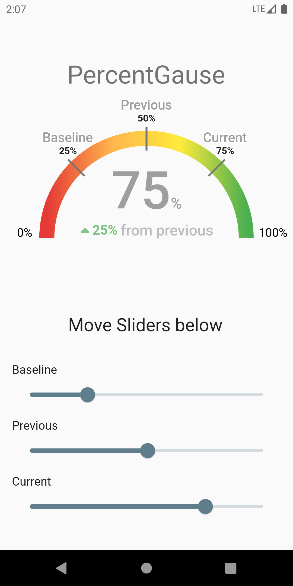

# Gause UI

This is an app showing a Gause Widget, whose 3 possible values can be managed through three sliders located at the bottom of the page.
Each indicator displays a legend saying the selected slider and its current value.
In the middle of the arc you'll get information about the latest edited slider.

## Screenshots
 

## Demo

